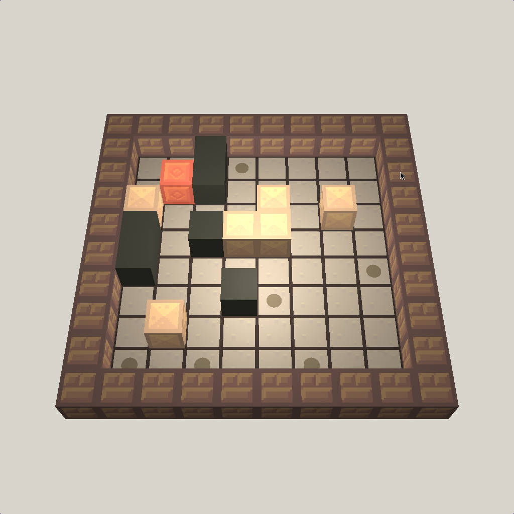

# PROG2002 Exam Autumn 2023

My project for the PROG2002 Graphics Programming exam. It's a Sokoban game made using OpenGL and C++



## Running

```sh
mkdir -p build && cd build && cmake .. && make && ./bin/exam
```

## Project structure

- `exam/main.cpp` is responsible for orchestrating all state and rendering.
- `exam/game/*` contains structures for handling game logic and state
- `exam/rendering/*` contains rendering code
- `exam/constants.h` contains all constants

## References

Phong lighting: https://learnopengl.com/Advanced-Lighting/Advanced-Lighting

## Assets

All the textures are from https://www.kenney.nl/assets/pixel-platformer-blocks, which has a CC0 licence.
